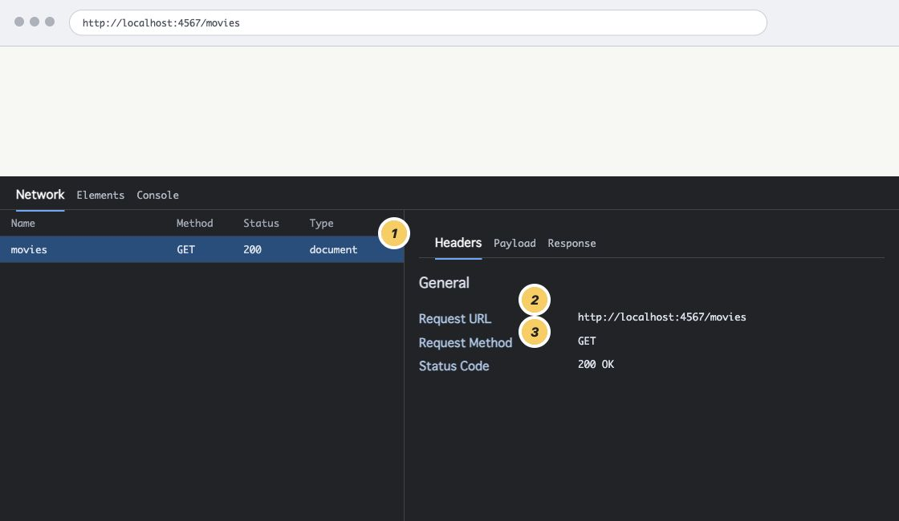

# 第1章 Web アプリケーションはどこで動いているのか

完成した映画図鑑では、一覧から映画を選び、詳しい情報を見たり、新しい映画を登録したりできます。ブラウザに表示された画面だけを見ると、映画図鑑そのものがブラウザの中で動いているように感じるかもしれません。

ところが、本書で作る映画図鑑では、映画を探す処理や保存する処理は Ruby のプログラムが担当します。ブラウザと Ruby のプログラムは、どのようにつながるのでしょうか。この章では、ブラウザが情報を送り、サーバーから結果を受け取るまでの流れをたどります。

## 1.1 ブラウザだけでは映画図鑑は動かない

ブラウザは HTML を読み取り、見出し、文章、リンク、フォームなどを画面に表示します。CSS を読み取って見た目を整えることもできます。HTML と CSS のファイルが手元にあれば、ファイルを直接ブラウザで開いて内容を確認できます。

一方、映画図鑑には、画面を表示するだけでは終わらない処理があります。

- 保存されている映画を読み込む
- 指定された一件を探す
- フォームから送られた映画を保存する
- 指定された映画を更新または削除する

本書では、これらをサーバー側の Ruby プログラムで処理します。ブラウザは Ruby のプログラムを直接実行しません。ブラウザから処理を依頼し、処理結果を受け取ります。

ブラウザ側で JavaScript を動かす Web アプリケーションもありますが、本書では JavaScript を使いません。まず、ブラウザとサーバー側のプログラムが HTTP で情報をやり取りする基本形に集中します。

## 1.2 URL はファイル名ではなくリクエストの宛先

HTML ファイルを直接開いたとき、ブラウザのアドレスバーには次のような URL が表示されます。これは macOS での例です。ファイルの場所を表す部分は OS によって異なります。

```text
file:///Users/your-name/movie-catalog/index.html
```

末尾の `index.html` は、手元にあるファイルを指しています。それに対して、本書で作る映画図鑑へアクセスするときは、次のような URL を使います。

```text
http://localhost:4567/movies
```

この URL の各部分には役割があります。

| 部分 | 例 | 役割 |
| --- | --- | --- |
| スキーム | `http` | URL をどの仕組みで扱うかを表す |
| ホスト | `localhost` | 接続する相手を表す |
| ポート番号 | `4567` | 接続先で待ち受ける入口を表す |
| パス | `/movies` | 相手へ示すリクエストの宛先を表す |

`localhost` は、今使っているコンピューター自身を表す名前です。映画図鑑をローカル環境で起動すると、ブラウザと Ruby のプログラムは同じコンピューター上で動きます。それでも、ブラウザは URL を使って相手へアクセスします。

スキームが `http` なら、ブラウザは HTTP を使って相手へアクセスします。`file` なら、ネットワーク上の相手へリクエストを送るのではなく、手元のファイルを開きます。

ここで重要なのは、`/movies` が `movies.html` というファイルを表すとは限らないことです。サーバー側のプログラムは、`/movies` へのアクセスを受け取ったときに実行する処理を決められます。URL のパスと処理を対応付ける仕組みを**ルーティング**と呼びます。第2章では、Sinatra を使って実際にこの対応を作ります。

アドレスバーを見て、今開いている本書の URL と、手元の HTML ファイルを直接開いたときの URL を比べてみてください。`https://` または `http://` で始まっているか、`file://` で始まっているかによって、ブラウザがどこから内容を得たのかを区別できます。

## 1.3 リクエストとレスポンスの往復

ブラウザが URL へアクセスすると、ブラウザから Web アプリケーションへ**リクエスト**が送られます。リクエストは「この宛先について、この方法で処理してほしい」という依頼です。

リクエストを受け取った Web アプリケーションは処理を行い、ブラウザへ**レスポンス**を返します。レスポンスには、処理が成功したかどうかを表す情報や、ブラウザに表示してほしい HTML などが含まれます。

<figure>
  
  <figcaption>図 1-1 リクエストとレスポンスの往復</figcaption>
</figure>

この関係では、ブラウザが**クライアント**、リクエストを待ち受けてレスポンスを返す側が**サーバー**です。サーバーという言葉は、コンピューターそのものを指す場合と、リクエストを受け付けるプログラムを指す場合があります。本書では主に後者の意味で使います。

映画一覧を開くときの流れを、この図に当てはめると次のようになります。

1. ブラウザが `/movies` へリクエストを送る。
2. Web アプリケーションがリクエストを受け取る。
3. Web アプリケーションが映画の一覧を含むレスポンスを作る。
4. ブラウザがレスポンスを受け取り、HTML を画面に表示する。

Ruby のコードが動くのは 2 と 3 の側です。ブラウザが受け取るのは Ruby のソースコードではなく、Ruby の処理によって作られたレスポンスです。この境界が分かると、「Ruby の変数を変更したのに、なぜブラウザの画面へ直接反映されないのか」といった疑問を切り分けやすくなります。

## 1.4 HTTP のメッセージをテキストとして読む

ブラウザと Web アプリケーションは、勝手な形式で情報を送り合っているわけではありません。HTTP という共通の取り決めに従います。このような通信上の取り決めを**プロトコル**と呼びます。

HTTP/1.1 のリクエストは、必要な部分だけに絞ると次のように読めます。実際のブラウザは、この例にないヘッダーも送ります。

```http
GET /movies HTTP/1.1
Host: localhost:4567
Accept: text/html
```

最初の行にある `GET` は、処理の目的を示す **HTTP メソッド**です。`/movies` はリクエストの宛先となるパスです。2 行目以降の `Host` や `Accept` は**ヘッダー**で、接続先や受け取りたい内容についての追加情報を伝えます。

このリクエストに対するレスポンスは、次のように読めます。

```http
HTTP/1.1 200 OK
Content-Type: text/html; charset=utf-8

<!doctype html>
<html lang="ja">
  <head>
    <meta charset="utf-8">
    <title>映画図鑑</title>
  </head>
  <body>
    <h1>映画図鑑</h1>
  </body>
</html>
```

`200 OK` は**ステータスコード**と呼ばれ、リクエストが成功したことを表します。`Content-Type` ヘッダーは、レスポンス本文がどの種類のデータであるかを表します。空行より後ろの `<!doctype html>` から `</html>` までがレスポンスの本文です。この例では説明に必要な要素だけを載せており、実際の HTML には CSS を読み込む `link` 要素などが加わることもあります。

ブラウザはこの HTML を解釈し、「映画図鑑」という見出しとして画面に表示します。ブラウザに見えている画面と、サーバーが返したレスポンス本文は同じものではありません。画面は、ブラウザがレスポンス本文を解釈した結果です。

ここでは、次の対応を読み取れれば十分です。

| 確認するもの | リクエストまたはレスポンスでの例 | 分かること |
| --- | --- | --- |
| HTTP メソッド | `GET` | どのような目的のリクエストか |
| パス | `/movies` | どの宛先へのリクエストか |
| ステータスコード | `200 OK` | 処理がどのような結果になったか |
| ヘッダー | `Content-Type: text/html` | メッセージについての追加情報 |
| レスポンス本文 | `<!doctype html>` から `</html>` まで | ブラウザへ返された内容 |

サーバーが「リクエストされたものを見つけられなかった」と伝えるためのステータスコードが `404 Not Found` です。エラー時にも、ステータスコード、ヘッダー、本文を持つレスポンスを返せます。映画図鑑でも、存在しない URL や映画に対して 404 を返す処理を第10章で実装します。

> **HTTP のバージョンについて**
>
> この例では、構造を文字として追いやすい HTTP/1.1 の形式を使っています。HTTP/2 と HTTP/3 は通信時の内部表現が異なりますが、HTTP メソッド、ステータスコード、ヘッダーといった意味は引き継がれています。本書ではバージョンごとの通信方式には踏み込みません。

## 1.5 HTML を誰が用意するか

HTML をブラウザに表示する方法には、次の三つがあります。

一つ目は、自分のパソコンにある HTML ファイルを、ブラウザで直接開く方法です。この方法では、Web サーバーとは通信しません。

二つ目は、Web サーバーに保存されている HTML ファイルを受け取る方法です。Web サーバーは、あらかじめ作られた HTML ファイルをそのまま返します。

三つ目は、Ruby などのプログラムが作った HTML を、Web サーバーから受け取る方法です。映画図鑑では、この方法を使います。

二つ目と三つ目では、HTML の作り方が違います。ただし、どちらもブラウザが Web サーバーへリクエストを送り、レスポンスとして HTML を受け取ります。

違いを整理すると、次の三つに分けられます。

| 開き方 | HTTP のやり取り | HTML の用意の仕方 |
| --- | --- | --- |
| 手元の HTML ファイルを直接開く | ない | 手元のファイルをブラウザが読む |
| Web サーバー上の静的な HTML を開く | ある | 用意済みのファイルをサーバーが返す |
| 映画図鑑の画面を開く | ある | Ruby の処理が保存データを使って HTML を作る |

どの方法でも、画面を表示するために HTML を読むのはブラウザです。違うのは、HTML をどこから受け取るかと、誰が HTML を用意するかです。

映画図鑑では、同じ `/movies` へアクセスしても、映画を新しく登録した後には一覧の内容が変わります。あらかじめ固定した HTML ファイルを返すのではなく、その時点で保存されている映画からレスポンス本文を作るためです。このように、リクエストや保存データに応じて返す内容を組み立てられることが、これから作る Web アプリケーションの重要な性質です。

## 1.6 映画図鑑で作るリクエストの入口

映画図鑑には、一覧、詳細、登録、編集、削除の画面や処理を用意します。すべてを一つの画面、一つの処理へ詰め込まず、目的に応じた URL と HTTP メソッドへ分けます。

完成時の主な操作は次のとおりです。

| 操作 | ブラウザで起こすこと | Web アプリケーションの処理 |
| --- | --- | --- |
| 一覧を見る | 一覧の URL を開く | 保存されている映画を読み込んで表示する |
| 詳細を見る | 一件の映画へのリンクを開く | ID で映画を探して表示する |
| 登録する | フォームを送信する | 新しい ID を付けて映画を保存する |
| 編集する | 入力済みのフォームを送信する | ID が一致する映画を更新する |
| 削除する | 削除用のフォームを送信する | ID が一致する映画を削除する |

映画は最初から、データを一意に識別する ID、タイトル、監督、公開年、ジャンル、紹介文を持ちます。一覧では一部の情報だけを見せ、詳細では一件の情報をまとめて見せます。この違いを作ることで、URL が映画の一覧と一件の映画のどちらを指すかも具体的に考えられます。

この章では、まだコードを書きません。第2章で Sinatra を起動し、最初のリクエストを受け取るところから始めます。先にブラウザとサーバーの境界を押さえておくと、Sinatra の `get` を単なる Ruby の書き方ではなく、「どのリクエストへ、どのレスポンスを返すか」という対応として読めます。

## 1.7 Network パネルで往復を確かめる

ここまで説明したリクエストとレスポンスは、Chrome DevTools の Network パネルで観察できます。まず、`http://` または `https://` で開いている本書のページを対象に確認します。アドレスバーが `file://` で始まっている場合は、本書の公開ページを開いてください。リポジトリから確認している場合は、`mdbook serve` で表示された URL を使います。

1. Chrome で本書のページを開いたまま DevTools を開く。macOS では `Command + Option + I`、Windows と Linux では `Control + Shift + I` を押す。
2. `Network` パネルを選ぶ。
3. DevTools を開いたままページを再読み込みする。
4. リクエストの一覧から、現在のページに対応する `document` または `Doc` の行を選ぶ。
5. `Headers` タブと `Response` タブを開く。

Network パネルは、開いている間に発生したリクエストを記録します。パネルを開く前のリクエストが表示されていない場合があるため、開いた後に再読み込みします。

Chrome のバージョンや表示言語によって、`Doc`、`document`、タブの名前などが少し異なる場合があります。現在のページと同じ URL の行を手掛かりに選んでください。

選んだリクエストで、次の項目を探してください。

| 表示場所 | 項目 | 確認すること |
| --- | --- | --- |
| `Headers` の `General` | `Request URL` | どの URL へリクエストを送ったか |
| `Headers` の `General` | `Request Method` | どの HTTP メソッドを使ったか |
| `Headers` の `General` | `Status Code` | どの結果が返ったか |
| `Headers` | `Request Headers` | ブラウザが送った追加情報 |
| `Headers` | `Response Headers` | サーバーが返した追加情報 |
| `Response` または `Preview` | レスポンス本文 | ブラウザが受け取った内容 |

最初からすべてのヘッダーを理解する必要はありません。まずは `Request URL`、`Request Method`、`Status Code` の三つを見つけてください。その三つだけでも、「どこへ」「どの方法で」リクエストを送り、「どの結果が」返ったかを読み取れます。

<figure class="book-figure">
  
  <figcaption>図 1-2 Network パネルで最初に確認する三項目</figcaption>
</figure>

見つけた値を使い、「ブラウザは〇〇へ GET リクエストを送り、〇〇というステータスコードのレスポンスを受け取った」と一文で説明してみてください。

`Response` に表示された HTML と、ブラウザに表示されている画面も比べてみます。HTML のタグがそのまま画面に並んでいるのではなく、ブラウザが見出しや段落として解釈していることを確認できます。

最後に、次の説明のどこが誤っているかを考えてみてください。

> ブラウザは URL から Ruby のコードを受け取り、その Ruby コードを実行して映画一覧を表示する。

ブラウザが送るのはリクエストです。Ruby のコードはサーバー側でリクエストを処理し、レスポンスを作ります。ブラウザが受け取って解釈するのは、そのレスポンスです。

次章では、この往復の右側にある Web アプリケーションを Sinatra で起動します。`GET /movies` というリクエストと Ruby の処理を結び付け、Network パネルで自分のアプリのレスポンスを確認します。

## さらに学ぶ

HTTP には、HTTP/1.1、HTTP/2、HTTP/3 という複数のバージョンがあります。実際の Web ではどれか一つだけが使われているわけではなく、接続先や環境に応じて使い分けられています。公開されている Web サイトでは HTTP/2 や HTTP/3 も広く使われていますが、本書で起動するローカルの Sinatra アプリとの通信には HTTP/1.1 が使われます。

普段、利用者やアプリケーション開発者がバージョンを選んでリクエストを書く必要はありません。対応するバージョンをブラウザとサーバーが判断するためです。実際に使われたバージョンは、Network パネルのリクエスト一覧を右クリックして `Protocol` の列を表示すると確認できます。`http/1.1`、`h2`、`h3` は、それぞれ HTTP/1.1、HTTP/2、HTTP/3 を表します。

最初に押さえたいのは、どのバージョンにも共通するリクエストとレスポンスの意味です。この章では、通信内容を文字として読みやすい HTTP/1.1 の例を使い、メソッド、パス、ステータスコード、ヘッダー、本文を学びました。Web アプリケーションを作り始めるうえでは、まずこの共通部分を理解すれば十分です。複数のリクエストを効率よく運ぶ仕組みや通信性能を詳しく調べる段階で、HTTP/2 や HTTP/3 の違いへ進むとよいでしょう。

## 参考資料

- [HTTP: ハイパーテキスト転送プロトコル - MDN Web Docs](https://developer.mozilla.org/ja/docs/Web/HTTP)
- [ウェブサーバーとは - MDN Web Docs](https://developer.mozilla.org/ja/docs/Learn_web_development/Howto/Web_mechanics/What_is_a_web_server)
- [Network features reference - Chrome for Developers](https://developer.chrome.com/docs/devtools/network/reference/)
- [RFC 9110: HTTP Semantics](https://www.rfc-editor.org/info/rfc9110/)
- [RFC 9112: HTTP/1.1](https://www.rfc-editor.org/info/rfc9112/)
- [RFC 9113: HTTP/2](https://www.rfc-editor.org/info/rfc9113/)
- [RFC 9114: HTTP/3](https://www.rfc-editor.org/info/rfc9114/)
