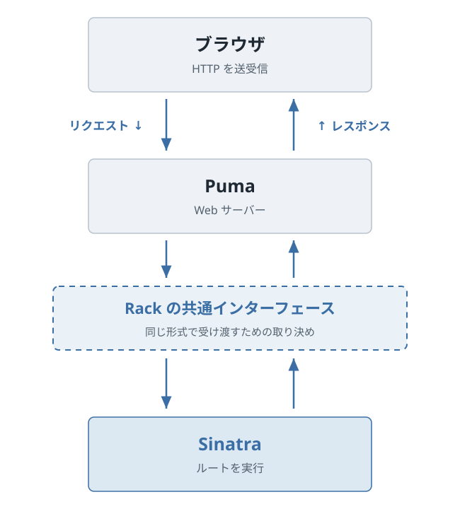

# 第2章 Sinatra をはじめる

第1章では、ブラウザがリクエストを送り、Web アプリケーションがレスポンスを返す往復を見ました。この章では、その往復のサーバー側を初めて作ります。

最初に返す内容は、「映画図鑑」という短い文字列だけです。小さいレスポンスから始めると、URL、Sinatra のルート、ブラウザに返る内容の対応を一つずつ追えます。

**この章のゴール:** Sinatra アプリを起動し、URL とルーティングの対応を追いながら最小のレスポンスを返せる。

## 2.1 Sinatra が結ぶリクエストと Ruby

Sinatra は、Ruby で Web アプリケーションを作るためのフレームワークです。第1章で説明したリクエストのうち、**HTTP メソッドとパスの組み合わせ**を Ruby の処理へ対応付けられます。

たとえば、次のコードは `GET /movies` というリクエストに対応します。

```ruby
get "/movies" do
  "映画図鑑"
end
```

このような対応を**ルート**と呼びます。コードの各部分は、次の意味を持ちます。

| コード | 対応するもの |
| --- | --- |
| `get` | HTTP メソッドの `GET` |
| `"/movies"` | リクエストのパス `/movies` |
| `do` から `end` | リクエストが一致したときに実行する処理 |
| `"映画図鑑"` | レスポンス本文になる文字列 |

`get` は、Sinatra が用意する Ruby のメソッドです。Web アプリケーションのルートを短く書けるように、Sinatra はこのような専用の書き方を提供しています。特定の用途に合わせて用意された書き方のまとまりを **DSL（Domain-Specific Language）** と呼びます。英語の展開を覚えることよりも、`get` が HTTP の `GET` と Ruby の処理を結び付けている点を押さえてください。

このコードがブラウザで実行されるわけではありません。Sinatra アプリが `GET /movies` を受け取るとブロックを実行し、最後に評価された文字列を使ってレスポンスを作ります。

## 2.2 作業用リポジトリを用意する

ここからは、本書のリポジトリにあるファイルを使いながら映画図鑑を作ります。まだリポジトリを取得していない場合は、ターミナルで次のコマンドを実行します。

```sh
git clone https://github.com/fjordllc/sinatra-textbook-ja.git
cd sinatra-textbook-ja
git switch -c chapter-02-work chapter-01
```

`git clone` は本書のリポジトリを手元へ複製します。`cd` で、複製してできた `sinatra-textbook-ja` ディレクトリへ移動します。

最後のコマンドは、第1章が終わった時点を示す `chapter-01` タグから、`chapter-02-work` という作業用ブランチを作ります。本書のリポジトリの `main` ブランチは、執筆が進むにつれて後の章のコードへ更新されます。開始タグを指定することで、第2章の手順どおりに `app.rb` を作れる状態から始められます。

現在いるディレクトリは、次のコマンドで確認できます。

```sh
pwd
```

出力の末尾が `sinatra-textbook-ja` なら、以降のコマンドを実行する**リポジトリのルート**にいます。すでにリポジトリを取得し、`chapter-01` から作業用ブランチを作っている場合は、同じ操作を繰り返す必要はありません。

## 2.3 バージョンをそろえる三つのファイル

コードを書く前に、本書と同じ環境を使えることを確認します。リポジトリのルートには、次の三つのファイルがあります。

```text
.
├── .ruby-version
├── Gemfile
└── Gemfile.lock
```

三つはどれもバージョンに関係しますが、役割が異なります。

| ファイル | 決めるもの | 本書での例 |
| --- | --- | --- |
| `.ruby-version` | Ruby 本体のバージョン | Ruby 4.0.6 |
| `Gemfile` | 必要な Gem と許容するバージョン範囲 | Sinatra 4.2 系 |
| `Gemfile.lock` | 実際に使う Gem の組み合わせ | Sinatra 4.2.1 |

`.ruby-version` には、次の一行があります。

```text
4.0.6
```

Ruby のバージョン管理ツールは、このファイルに対応していれば、ディレクトリで使う Ruby を選ぶときに参照します。`.ruby-version` があるだけで Ruby 本体がインストールされるわけではありません。ターミナルで確認します。

```sh
ruby -v
```

出力の先頭が `ruby 4.0.6` であることを確認してください。異なる場合は、これまで使ってきた Ruby のバージョン管理方法で 4.0.6 を用意してから進みます。本書では、Ruby のインストール方法やバージョン管理ツールの比較は扱いません。

`Gemfile` は、アプリに必要な Gem を宣言するファイルです。本書では次の内容を使います。

```ruby
source "https://rubygems.org"

ruby "4.0.6"

gem "puma", "~> 8.0.0"
gem "rackup", "~> 2.3.0"
gem "sinatra", "~> 4.2.0"
```

Sinatra はルーティングなど、Web アプリケーションを書く機能を提供します。Puma は HTTP リクエストを受け付ける Web サーバーです。rackup は、Sinatra が Puma を起動するときに使う機能を提供します。それぞれの関係は、アプリを最初に動かした後で確かめます。

`~> 4.2.0` は 4.2 系のパッチバージョンを許容する指定です。`Gemfile` だけでは、4.2 系のどのバージョンが選ばれたかまでは決まりません。

`Gemfile.lock` には、Bundler が実際に選んだ Gem とバージョンが記録されます。このリポジトリでは Sinatra 4.2.1、Puma 8.0.2、rackup 2.3.1 などが固定されています。`Gemfile.lock` は Bundler が更新するため、手では編集しません。Git へコミットして、同じリポジトリを使う人が同じ組み合わせを利用できるようにします。

## 2.4 Bundler で必要な Gem を用意する

Bundler は、`Gemfile` と `Gemfile.lock` に従って Gem の組み合わせを管理します。まず、Bundler のバージョンを確認します。

```sh
bundle -v
```

本書では Bundler 4.0.16 で動作を確認しています。異なるバージョンが表示された場合は、次のコマンドで 4.0.16 をインストールします。

```sh
gem install bundler -v 4.0.16
```

インストール後、リポジトリのルートでもう一度 `bundle -v` を実行し、出力に `4.0.16` が含まれることを確認します。続いて、必要な Gem をインストールします。

```sh
bundle install
```

初回は Gem のダウンロードに時間がかかることがあります。最後に `Bundle complete!` と表示され、エラーなくコマンドが終了すれば準備できています。すでにインストール済みの場合も、Bundler は現在の状態を確認します。

この章から、Ruby のプログラムは次の形で実行します。

```sh
bundle exec ruby app.rb
```

`bundle exec` は、`Gemfile` と `Gemfile.lock` で管理している Gem を使える状態にして、後ろのコマンドを実行します。単に `ruby app.rb` とした場合、環境に別のバージョンの Sinatra が入っていれば、意図しない組み合わせが選ばれる可能性があります。本書では起動方法を一つにそろえるため、常に `bundle exec` を付けます。

## 2.5 最初のルートを `app.rb` に書く

リポジトリのルートに `app.rb` を作り、次のコードを書きます。

```ruby
# frozen_string_literal: true

require "sinatra"

get "/" do
  "映画図鑑を作ります"
end
```

`require "sinatra"` によって Sinatra を読み込み、`get` などの DSL を使えるようにします。

`"/"` は URL のルートとなるパスです。`GET /` を受け取ると、Sinatra はこのブロックを実行します。ブロックの最後の文字列 `"映画図鑑を作ります"` がレスポンス本文になります。

第1章で見た対応に当てはめてみます。

```http
GET / HTTP/1.1
Host: localhost:4567
```

このリクエストに `get "/"` が一致し、レスポンス本文として次の文字列が返ります。

```text
映画図鑑を作ります
```

まだ HTML の要素は返していません。まずは、文字列を返す最小のルートが動くことを確認します。

## 2.6 Puma で Sinatra アプリを起動する

`app.rb` があるディレクトリで、次のコマンドを実行します。

```sh
bundle exec ruby app.rb
```

起動に成功すると、Sinatra 4.2.1、Puma 8.0.2、Ruby 4.0.6 といった情報に続いて、次のような待ち受け先が表示されます。細かな出力は環境によって異なります。

```text
Listening on http://127.0.0.1:4567
```

コマンド入力へ戻らないのは、処理が止まったからではありません。Puma がポート 4567 でリクエストを待ち受けているためです。このターミナルはそのままにして、Chrome で次の URL を開きます。

```text
http://localhost:4567/
```

画面に「映画図鑑を作ります」と表示されれば、`GET /` のリクエストと `get "/"` のルートがつながっています。Network パネルでも Request Method が `GET`、Status Code が `200 OK`、Response が「映画図鑑を作ります」であることを確認してください。

アプリを停止するときは、起動したターミナルで `Control + C` を押します。本書の構成では、コードを変更しても起動中のアプリへ自動では反映されません。これから `app.rb` を変更するたびに、`Control + C` で停止し、同じ起動コマンドをもう一度実行します。

起動時に `Address already in use` と表示された場合は、別のターミナルで前に起動したアプリが動き続けていないか確認します。詳しい切り分けは、[付録D「よくあるエラー」](../appendix/d.md)で扱います。

## 2.7 Puma、Rack、Sinatra の受け渡し

起動時の表示には、Sinatra と Puma という名前がありました。`Gemfile` に書いた Sinatra、Puma、rackup は、それぞれ同じ役割を持つものではありません。

<figure>
  
  <figcaption>図 2-1 Puma、Rack、Sinatra の受け渡し</figcaption>
</figure>

図の下向きの矢印は、ブラウザから Sinatra へ届くリクエストです。上向きの矢印は、Sinatra からブラウザへ戻るレスポンスです。

ブラウザから届いた HTTP リクエストを最初に受け付けるのが Puma です。Puma は、Ruby の Web アプリケーションへリクエストを渡し、返されたレスポンスをブラウザへ送ります。

Web サーバーと Web アプリケーションの間では、情報をどの形で受け渡すかをそろえる必要があります。その共通のインターフェースを定めるのが Rack です。図では Rack を、Puma や Sinatra と同じ実行主体の箱ではなく、両者が従う共通の取り決めを表す境界として示しています。

Sinatra は Rack のインターフェースに従う **Rack アプリケーション**です。Sinatra は Rack との細かな受け渡しを担当しながら、私たちには `get "/movies"` のようなルーティングの書き方を提供します。Rails も Rack の上で動く Web アプリケーションです。今後 Rails を使うときにも、ブラウザ、Web サーバー、Rack、アプリケーションという関係は残ります。

rackup は、本書の起動方法で Sinatra が Puma を起動するために使うサーバーハンドラーを提供します。アプリを起動するために必要な Gem ですが、別のサーバーとして起動するわけではありません。

本書では、`require "sinatra"` と書き、ルートをトップレベルに定義する **Classic Style** を使います。一つの小さなアプリを一つの `app.rb` から始めるため、クラスを定義せずルーティングへ集中できる書き方を選びます。別の書き方である Modular Style の比較は、本書の範囲外です。

## 2.8 URL ごとに別のルートを選ぶ

映画図鑑の入口には `/movies` というパスを使います。`app.rb` の末尾へ、二つ目のルートを追加します。

```ruby
get "/movies" do
  "映画図鑑"
end
```

アプリを再起動し、二つの URL を順に開きます。

```text
http://localhost:4567/
http://localhost:4567/movies
```

`/` では「映画図鑑を作ります」、`/movies` では「映画図鑑」と表示されます。同じ Puma と Sinatra のプロセスへ送った `GET` リクエストでも、パスが異なるため別のルートが選ばれます。

ルートはパスだけで決まるものではありません。Sinatra では、HTTP メソッドとパスの組み合わせが一致するルートを探します。この章では `GET` だけを使いますが、後の章では同じ `/movies` というパスへ `POST` を送るルートも作ります。

## 2.9 `/` から `/movies` へ移動させる

映画図鑑の一覧は `/movies` で表示する方針です。利用者がルート URL の `/` を開いたときも、`/movies` へ移動するようにします。

`get "/movies"` は残したまま、`get "/"` のブロックだけを次のように変更します。

```ruby
get "/" do
  redirect "/movies"
end
```

`redirect` は Sinatra が用意するヘルパーメソッドです。この場合、`/movies` の内容を `GET /` のレスポンス本文として返すわけではありません。ブラウザへ「次は `/movies` をリクエストしてください」と伝える**リダイレクトレスポンス**を返します。

アプリを再起動し、アドレスバーへ次の URL を入力します。

```text
http://localhost:4567/
```

最終的に「映画図鑑」と表示され、アドレスバーが `http://localhost:4567/movies` へ変わります。画面だけを見ると一度のアクセスで `/movies` が表示されたように見えますが、裏では二つのリクエストが発生しています。

## 2.10 Network パネルで二つの GET を見る

Network パネルを開いたまま、もう一度 `http://localhost:4567/` へアクセスします。記録されたリクエストを時刻順に見ると、次の流れを確認できます。

1. `GET /` に対して `302 Found` が返り、`/movies` へ移動するよう伝える。
2. `GET /movies` に対して `200 OK` が返り、「映画図鑑」という本文を受け取る。

最初の `GET /` を選び、`Headers` の `Response Headers` にある `Location` を探します。

```http
Location: http://localhost:4567/movies
```

`302 Found` はリダイレクトを表すステータスコードの一つです。ブラウザは `Location` ヘッダーを読み、新しい `GET /movies` リクエストを送ります。二つ目の `200 OK` のレスポンス本文を受け取ってから、「映画図鑑」を画面へ表示します。

起動したターミナルのログにも、次のような二行が表示されます。

```text
"GET / HTTP/1.1" 302
"GET /movies HTTP/1.1" 200
```

日時や処理時間など、前後の表示は環境によって異なります。ここで見るのは、HTTP メソッド、パス、ステータスコードです。

リダイレクトを使う理由やステータスコードの選び方は、フォームからデータを変更した後に重要になります。第8章で PRG パターンとして改めて説明します。この章では、リダイレクトが「別の URL へ移動した画面」ではなく、次のリクエストを促すレスポンスであることを押さえます。

`redirect "/movies"` が、`get "/movies"` のブロックをその場で呼び出しているわけではありません。最初のレスポンスを受け取ったブラウザが、別の `GET /movies` を送ることで二つ目のルートが実行されます。この区別は、Network パネルの二つの行とターミナルの二つのログで確認できます。

ここで見た流れを、「ブラウザ」「302 のレスポンス」「二つ目の GET」という三つの言葉を使って一文で説明してみてください。`/movies` の本文が最初のレスポンスに含まれている、という説明になっていないかも確認します。

## 2.11 この章のコードを確認する

この章の終了時点で、`app.rb` は次の内容になります。

```ruby
# frozen_string_literal: true

require "sinatra"

get "/" do
  redirect "/movies"
end

get "/movies" do
  "映画図鑑"
end
```

二つのルートを、リクエストとレスポンスへ対応付けると次のようになります。

- `GET /`: `redirect "/movies"` を実行し、302 と `/movies` を示す `Location` ヘッダーを返す。
- `GET /movies`: `"映画図鑑"` を評価し、200 と「映画図鑑」という本文を返す。

次章では、`"映画図鑑"` という文字列を HTML の画面へ育てます。`app.rb` に長い HTML を直接書き続けず、ERB テンプレートと `views/` ディレクトリを使って、Ruby のデータから映画一覧を作ります。そのときは、レスポンスヘッダーの `Content-Type` も Network パネルで確認します。

## さらに学ぶ

Rack は、Ruby の Web サーバーと Web アプリケーションが同じ方法でリクエストとレスポンスを受け渡すための共通インターフェースです。共通のインターフェースがあることで、Sinatra は Puma からリクエストを受け取れます。

本章では、Rack を独立したサーバーやフレームワークとして操作しませんでした。Sinatra を使うと、Rack の受け渡しを直接書かずにルーティングへ集中できます。後の章で method override を使うときには、フォームから届いたリクエストを Sinatra のルートへ渡す前に Rack が処理する例を見ます。

## 参考資料

- [Sinatra: README - Getting Started, Routes, Return Values, Browser Redirect, Modular vs. Classic Style, Rack Middleware](https://sinatrarb.com/intro.html)
- [Bundler: Gemfile](https://bundler.io/guides/gemfile.html)
- [Bundler: bundle exec](https://bundler.io/man/bundle-exec.1.html)
- [Rack: a Ruby Webserver Interface](https://rack.github.io/)
- [sinatra 4.2.1 - RubyGems.org](https://rubygems.org/gems/sinatra/versions/4.2.1)
- [puma 8.0.2 - RubyGems.org](https://rubygems.org/gems/puma/versions/8.0.2)
