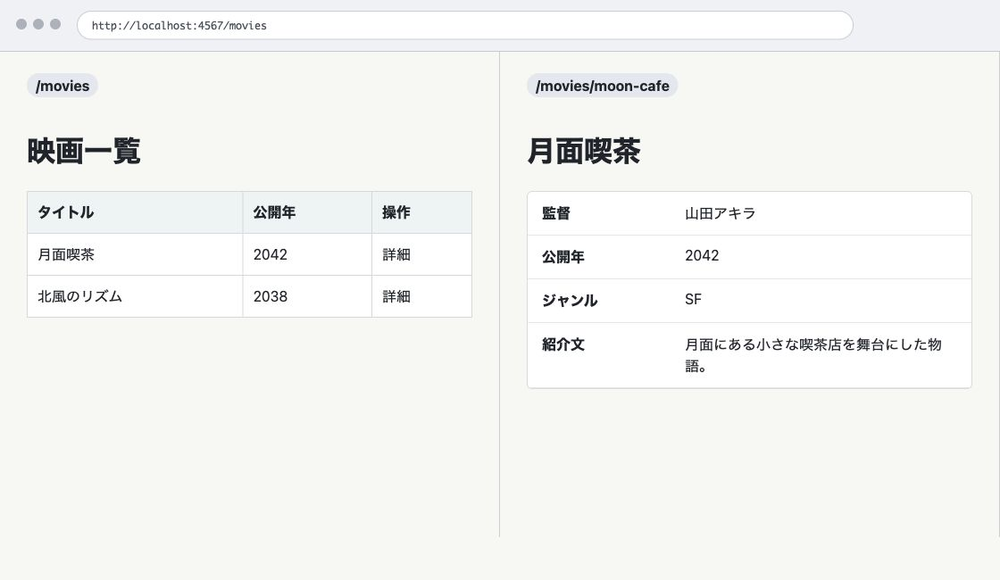

# 第6章 一覧と詳細でリソースを分ける

第5章では、映画を `data/movies.json` に保存できるようにしました。登録に成功すると、一覧画面へ戻るところまで作りました。

この章では、映画の一覧と詳細を分けます。Web では、URL で指し示して扱う対象をリソースと呼びます。`/movies` を映画の集合、`/movies/:id` を 1 件の映画として扱い、ID で映画を探して詳細画面を表示します。

## `/movies` は映画の集合を表す

現在の `/movies` は、登録されている映画の一覧を表示します。

```ruby
get "/movies" do
  @movies = load_movies
  erb :index
end
```

`@movies` には、複数の映画が入ります。つまり `/movies` は、映画 1 件ではなく、映画の集合を表す URL です。

一覧画面では、タイトル、公開年、ジャンルだけを表示します。監督や紹介文まで一覧に出すと、情報量が増えすぎます。すべてを一覧に詰め込むのではなく、1 件の映画を詳しく見るための画面を作ります。

## `/movies/:id` は 1 件の映画を表す

1 件の映画を表す URL は、次の形にします。

```text
/movies/:id
```

`:id` は、実際の URL では映画の ID に置き換わります。

```text
/movies/b6f5e1c4-4b5f-4a7f-8f8f-3d9d3ef9d001
```

Sinatra では、ルートに `:id` のように書くと、その部分を `params["id"]` として取り出せます。

```ruby
get "/movies/:id" do
  params["id"]
end
```

このルートは、`/movies/new` より前に書くと意図しない動きになることがあります。`/movies/new` も `:id` の形に見えるからです。本書のコードでは、`get "/movies/new"` より後に `get "/movies/:id"` を置きます。具体的なルートを先に書き、変化する部分を含むルートを後に書く、と覚えておくと追いやすくなります。

## ID で映画を探す

詳細画面では、JSON から読み込んだ映画配列の中から、ID が一致する 1 件を探します。

`app.rb` に `find_movie` メソッドを追加します。

```ruby
def find_movie(id)
  load_movies.find { |movie| movie["id"] == id }
end
```

`find` は、条件に合う最初の要素を返します。ここでは、映画の `"id"` と URL から届いた `id` が一致する映画を探しています。

一致する映画がなければ、`find` は `nil` を返します。

この章では、分かりやすさを優先して `find_movie` の中で毎回 JSON ファイルを読み込んでいます。小さなローカル教材アプリでは問題ありませんが、データが増えた場合の効率やファイル保存の限界は第12章で扱います。

## 詳細画面を表示する

URL で指定された ID が、保存されている映画の ID と一致すれば、映画を表示できます。一致する映画がなければ、表示する内容はありません。その場合は Sinatra の `halt` で処理を止め、404 ステータスコードとメッセージを返します。

この処理を含む `GET /movies/:id` を追加します。

```ruby
get "/movies/:id" do
  @movie = find_movie(params["id"])
  halt 404, "映画が見つかりません" if @movie.nil?

  erb :show
end
```

`@movie` に 1 件の映画を入れ、`views/show.erb` を表示します。

`halt 404, "映画が見つかりません"` の行は、`@movie` が `nil` の場合だけ実行されます。ここでは専用の 404 ページはまだ作りません。存在しない ID に対して 404 のレスポンスを返すところまでを扱います。404 ページは第10章で作ります。

`views/show.erb` を作ります。

```erb
<h1><%= h(@movie["title"]) %></h1>

<dl class="movie-detail">
  <div>
    <dt>監督</dt>
    <dd><%= h(@movie["director"]) %></dd>
  </div>
  <div>
    <dt>公開年</dt>
    <dd><%= h(@movie["year"]) %></dd>
  </div>
  <div>
    <dt>ジャンル</dt>
    <dd><%= h(@movie["genre"]) %></dd>
  </div>
  <div>
    <dt>紹介文</dt>
    <dd class="movie-description"><%= h(@movie["description"]) %></dd>
  </div>
</dl>

<p>
  <a href="/movies">一覧へ戻る</a>
</p>
```

詳細画面では、タイトル、監督、公開年、ジャンル、紹介文を表示します。一覧に出していなかった監督と紹介文も、ここで確認できるようにします。

第5章で導入した `h` ヘルパーを、詳細画面でも使います。映画の各項目は、フォームから入力された値です。タイトルだけでなく、監督、公開年、ジャンル、紹介文も HTML エスケープして表示します。

## 紹介文の改行は CSS で扱う

紹介文に改行が含まれている場合、HTML ではそのまま改行として表示されるとは限りません。

Ruby 側で次のように `<br>` を追加する方法は、この教材では使いません。

```ruby
description.gsub("\n", "<br>")
```

利用者入力から HTML を組み立てると、エスケープとの関係が複雑になります。表示のための改行は、CSS で扱います。

```css
.movie-description {
  white-space: pre-line;
}

@media (max-width: 600px) {
  .movie-detail div {
    grid-template-columns: 1fr;
  }
}
```

`white-space: pre-line` を使うと、テキスト中の改行を表示に反映できます。紹介文の文字列そのものは、`h` ヘルパーで安全に表示します。

詳細画面の見た目のために、次の CSS も追加します。

```css
.movie-detail {
  max-width: 720px;
  margin: 24px 0;
  background: #ffffff;
}

.movie-detail div {
  display: grid;
  grid-template-columns: 120px 1fr;
  border: 1px solid #dddddd;
  border-bottom: 0;
}

.movie-detail div:last-child {
  border-bottom: 1px solid #dddddd;
}

.movie-detail dt,
.movie-detail dd {
  margin: 0;
  padding: 12px 14px;
}

.movie-detail dt {
  font-weight: 700;
  background: #edf3f4;
}
```

## 一覧から詳細へ移動する

一覧画面から詳細画面へ移動できるようにします。`views/index.erb` の表に「操作」列を追加します。

```erb
<th scope="col">操作</th>
```

各行に詳細リンクを追加します。

```erb
<td><a href="/movies/<%= h(movie["id"]) %>">詳細</a></td>
```

`href` に映画の ID を埋め込むことで、1 件の映画を表す URL へ移動できます。ID は利用者が直接入力した値ではありませんが、HTML に出力する値として `h` を通します。

<figure class="book-figure">
  
  <figcaption>図 6-1 一覧を表す URL と一件を表す URL</figcaption>
</figure>

## 登録後は詳細画面へ移動する

第5章では、登録成功後に一覧画面へ戻していました。

```ruby
redirect "/movies"
```

詳細画面ができたので、登録した映画をすぐ確認できるように、登録後は詳細画面へ移動します。

`POST /movies` の後半を次のように変更します。

```ruby
movies = load_movies
movie = { "id" => SecureRandom.uuid }.merge(@movie)
movies << movie
save_movies(movies)

redirect "/movies/#{movie["id"]}"
```

新しく作った映画の ID を使って、`/movies/:id` へリダイレクトしています。

Network タブでは、次の流れを確認できます。

```text
POST /movies
303 See Other
GET /movies/:id
```

第5章では `GET /movies` へ移動していました。この章からは、登録した 1 件を確認するために `GET /movies/:id` へ移動します。

## 存在しない ID を確認する

ブラウザで、存在しない ID を含む URL にアクセスしてみます。

```text
http://localhost:4567/movies/not-found
```

映画が見つからないため、レスポンスのステータスコードは 404 になります。Network タブで、`GET /movies/not-found` のステータスコードを確認してください。

ここで大事なのは、画面に表示される文字列だけではありません。HTTP レスポンスとして 404 が返っていることです。

## この章の完成コード

この章の最後の `app.rb` は次の形です。

```ruby
require "json"
require "rack/utils"
require "securerandom"
require "sinatra"

MOVIES_FILE = File.join(__dir__, "data", "movies.json")

helpers do
  def h(value)
    Rack::Utils.escape_html(value)
  end
end

def load_movies
  JSON.parse(File.read(MOVIES_FILE))
end

def save_movies(movies)
  File.write(MOVIES_FILE, "#{JSON.pretty_generate(movies)}\n")
end

def find_movie(id)
  load_movies.find { |movie| movie["id"] == id }
end

def movie_params
  {
    "title" => params["title"].to_s,
    "director" => params["director"].to_s,
    "year" => params["year"].to_s,
    "genre" => params["genre"].to_s,
    "description" => params["description"].to_s
  }
end

get "/" do
  redirect "/movies"
end

get "/movies" do
  @movies = load_movies
  erb :index
end

get "/movies/new" do
  @movie = {}
  @errors = []
  erb :new
end

get "/movies/:id" do
  @movie = find_movie(params["id"])
  halt 404, "映画が見つかりません" if @movie.nil?

  erb :show
end

post "/movies" do
  @movie = movie_params
  @errors = []

  if @movie["title"].strip.empty?
    @errors << "タイトルを入力してください"
    status 422
    return erb :new
  end

  movies = load_movies
  movie = { "id" => SecureRandom.uuid }.merge(@movie)
  movies << movie
  save_movies(movies)

  redirect "/movies/#{movie["id"]}"
end
```

`views/index.erb` は次の形です。

```erb
<h1>映画一覧</h1>

<p>登録されている映画を一覧で表示します。</p>

<p>
  <a class="button-link" href="/movies/new">新しい映画を登録</a>
</p>

<div class="table-scroll">
  <table class="movie-table">
    <thead>
      <tr>
        <th scope="col">タイトル</th>
        <th scope="col">公開年</th>
        <th scope="col">ジャンル</th>
        <th scope="col">操作</th>
      </tr>
    </thead>
    <tbody>
      <% @movies.each do |movie| %>
        <tr>
          <td><%= h(movie["title"]) %></td>
          <td><%= h(movie["year"]) %></td>
          <td><%= h(movie["genre"]) %></td>
          <td><a href="/movies/<%= h(movie["id"]) %>">詳細</a></td>
        </tr>
      <% end %>
    </tbody>
  </table>
</div>
```

`views/show.erb` は次の形です。

```erb
<h1><%= h(@movie["title"]) %></h1>

<dl class="movie-detail">
  <div>
    <dt>監督</dt>
    <dd><%= h(@movie["director"]) %></dd>
  </div>
  <div>
    <dt>公開年</dt>
    <dd><%= h(@movie["year"]) %></dd>
  </div>
  <div>
    <dt>ジャンル</dt>
    <dd><%= h(@movie["genre"]) %></dd>
  </div>
  <div>
    <dt>紹介文</dt>
    <dd class="movie-description"><%= h(@movie["description"]) %></dd>
  </div>
</dl>

<p>
  <a href="/movies">一覧へ戻る</a>
</p>
```

## 確認しよう

1. `/movies` の一覧から詳細リンクをクリックし、`/movies/:id` に移動することを確認する。
2. 詳細画面に、タイトル、監督、公開年、ジャンル、紹介文が表示されることを確認する。
3. `/movies/not-found` にアクセスし、Network タブで 404 を確認する。
4. `/movies/new` から映画を登録し、登録後に作成した映画の詳細画面へ移動することを確認する。

## 考えてみよう

- なぜ一覧画面にすべての属性を表示しないのでしょうか。
- `/movies` と `/movies/:id` は、どちらも映画に関係する URL ですが、何が違うのでしょうか。
- 存在しない ID に対して、なぜ通常の一覧画面ではなく 404 を返すのでしょうか。

次章では、この詳細画面から編集と削除へ進みます。1 件の映画を ID で扱えるようになったことで、既存の映画を変更したり削除したりする準備が整いました。

## さらに学ぶ

一覧と詳細を作った後は、URL が指す対象と、ルートが値を受け取る仕組みを深めると、別の題材にも応用できます。

- [MDN GET](https://developer.mozilla.org/ja/docs/Web/HTTP/Methods/GET)では、GET が情報を取得するためのメソッドであり、安全性やキャッシュとどのように関係するかを学べます。
- [Sinatra 公式ドキュメント](https://sinatrarb.com/intro.html)では、`/movies/:id` のようなルートパラメーターの受け取り方と、条件に応じて処理を止める方法を学べます。
