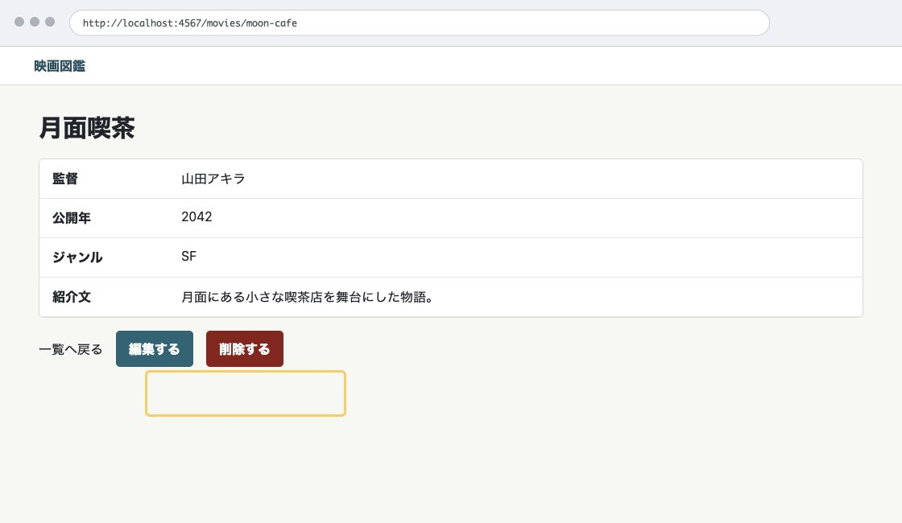
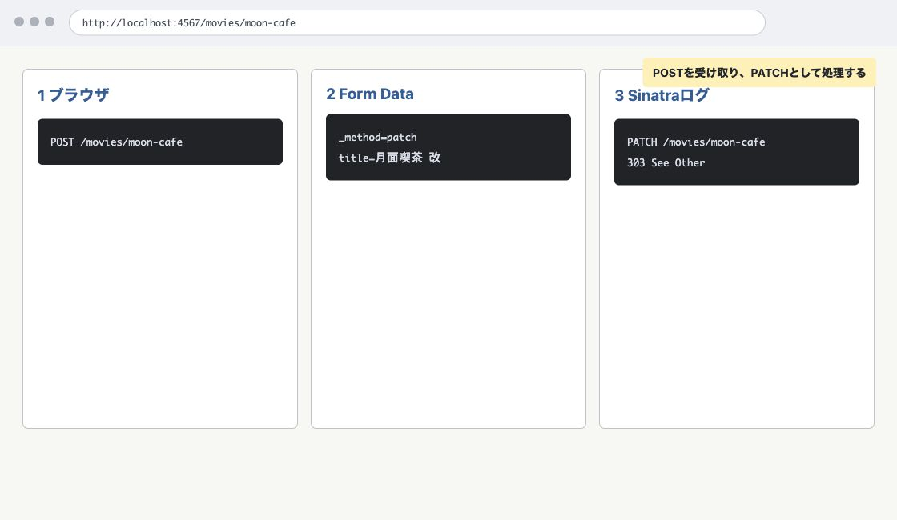

# 第7章 編集と削除で CRUD を完成させる

第6章では、映画の一覧と詳細を分け、ID で 1 件の映画を表示できるようにしました。

この章では、既存の映画を編集・削除できるようにします。その過程で、HTML フォームが直接送れる HTTP メソッドの制約と、POST を PATCH や DELETE として扱う仕組みを確認します。

## CRUD はデータへの基本操作

CRUD は、データに対する基本的な操作を表す言葉です。

| 操作 | 意味 | 映画図鑑での例 |
| --- | --- | --- |
| Create | 作成 | 映画を登録する |
| Read | 読み取り | 一覧や詳細を表示する |
| Update | 更新 | 映画情報を編集する |
| Delete | 削除 | 映画を削除する |

第6章までで、作成と読み取りは実装しました。この章では、更新と削除を追加します。

## method override を有効にする

HTML フォームが直接送信できる HTTP メソッドは、GET と POST です。`PATCH` や `DELETE` をフォームの `method` 属性に直接指定することはできません。

そこで、フォーム自体は POST で送り、hidden input の `_method` に本来扱いたいメソッドを書きます。

```erb
<input type="hidden" name="_method" value="patch">
```

Sinatra 側では、Rack の method override を有効にします。

```ruby
enable :method_override
```

これにより、POST で送られてきたリクエストに `_method=patch` が含まれていると、Sinatra のルートでは `patch "/movies/:id"` として扱えるようになります。

Network タブでは、ブラウザが送ったリクエストは POST として見えます。Form Data に `_method=patch` や `_method=delete` が含まれていることを確認します。Rack を通過した後に PATCH や DELETE として処理されたことは、Sinatra のログで確認します。

## 編集画面を表示する

編集画面は、既存の映画を変更するためのフォームです。表示するだけなので HTTP メソッドは GET です。

```ruby
get "/movies/:id/edit" do
  @movie = find_movie(params["id"])
  halt 404, "映画が見つかりません" if @movie.nil?

  @errors = []
  erb :edit
end
```

`GET /movies/:id/edit` は編集フォームを表示するためのルートです。ここではまだデータを更新しません。

このルートも、`GET /movies/:id` より前に書きます。`/movies/:id/edit` は、1 件の映画を表す URL に `/edit` が付いた形です。具体的なルートを先に書くことで、Sinatra が意図したルートへ到達しやすくなります。

## 編集フォームを作る

`views/edit.erb` を作ります。登録フォームとよく似ていますが、送信先と `_method` が違います。

```erb
<form class="movie-form" action="/movies/<%= h(@movie["id"]) %>" method="post">
  <input type="hidden" name="_method" value="patch">
```

フォームの `method` は `post` です。`_method` に `patch` を入れることで、Sinatra 側では `PATCH /movies/:id` として扱います。

編集フォームでは、登録済みの値を最初から入れておきます。

```erb
<input type="text" id="title" name="title" value="<%= h(@movie["title"]) %>">
```

`textarea` も登録済みの紹介文を入れます。

```erb
<textarea id="description" name="description" rows="5"><%= h(@movie["description"]) %></textarea>
```

登録フォームと編集フォームには共通する部分が多くあります。実務では部分テンプレートにまとめることもありますが、この章では送信先や `_method` の違いを読みやすくするため、別々の ERB として書きます。

## 更新処理を作る

既存の映画を更新するには、JSON から読み込んだ配列の中から ID が一致する映画を探し、そのハッシュを書き換えて保存します。

まず、読み込んだ配列の中から映画を探すメソッドを追加します。

```ruby
def find_movie_from(movies, id)
  movies.find { |movie| movie["id"] == id }
end
```

第6章の `find_movie` は、メソッドの中で JSON ファイルを読み込んでいました。更新では、読み込んだ配列を書き換えて保存する必要があるため、すでに読み込んだ `movies` から探すメソッドを使います。

`PATCH /movies/:id` を追加します。

```ruby
patch "/movies/:id" do
  movies = load_movies
  movie = find_movie_from(movies, params["id"])
  halt 404, "映画が見つかりません" if movie.nil?

  @movie = movie.merge(movie_params)
  @errors = []

  if @movie["title"].strip.empty?
    @errors << "タイトルを入力してください"
    return erb :edit
  end

  movie.merge!(@movie)
  save_movies(movies)

  redirect "/movies/#{movie["id"]}"
end
```

`movie_params` には、フォームから届いたタイトル、監督、公開年、ジャンル、紹介文だけが入ります。ID は含まれません。

`movie.merge(movie_params)` は、元の映画データにフォームから届いた値を重ねた新しいハッシュを作ります。元の映画データに入っていた ID は残ります。タイトルが空なら保存せず、編集フォームを再表示します。

入力に問題がなければ、`movie.merge!(@movie)` で配列の中にある映画ハッシュを書き換えます。`merge` は新しいハッシュを作り、`merge!` は元のハッシュを書き換えます。その後、配列全体を JSON ファイルへ保存します。

更新に成功したら、映画詳細画面へリダイレクトします。

この章では、更新後に直接 HTML を返さず、詳細画面へ移動する形を使います。このリダイレクトが再送信を防ぐ意味は、第8章で PRG として捉え直します。

## 詳細画面から編集へ進む

詳細画面に編集リンクを追加します。

<figure class="book-figure">
  
  <figcaption>図 7-1 詳細画面に集まる編集と削除の入口</figcaption>
</figure>

```erb
<a class="button-link" href="/movies/<%= h(@movie["id"]) %>/edit">編集する</a>
```

これで、詳細画面から編集画面へ移動できます。

## 詳細画面から削除する

削除は、詳細画面にフォームを置いて行います。HTML フォームは DELETE を直接送れないため、フォームの `method` は `post` にし、hidden input で `_method=delete` を送ります。

```erb
<form action="/movies/<%= h(@movie["id"]) %>" method="post">
  <input type="hidden" name="_method" value="delete">
  <button type="submit" class="danger-button">削除する</button>
</form>
```

この教材では、削除確認画面や JavaScript の確認ダイアログは使いません。誤操作対策は大切ですが、この章では HTTP メソッド、フォーム、ルーティングの関係に集中します。

`views/show.erb` の下部は次の形になります。

```erb
<div class="page-actions">
  <a href="/movies">一覧へ戻る</a>
  <a class="button-link" href="/movies/<%= h(@movie["id"]) %>/edit">編集する</a>
  <form action="/movies/<%= h(@movie["id"]) %>" method="post">
    <input type="hidden" name="_method" value="delete">
    <button type="submit" class="danger-button">削除する</button>
  </form>
</div>
```

`page-actions` は、詳細画面の主な操作をまとめるためのクラスです。一覧へ戻るリンク、編集リンク、削除フォームが離れすぎないよう、CSS で横並びにします。

## 削除処理を作る

`DELETE /movies/:id` を追加します。

```ruby
delete "/movies/:id" do
  movies = load_movies
  movie = find_movie_from(movies, params["id"])
  halt 404, "映画が見つかりません" if movie.nil?

  movies.delete(movie)
  save_movies(movies)

  redirect "/movies"
end
```

ID が一致する映画を見つけ、配列から削除し、JSON ファイルへ保存します。削除後は、削除した映画の詳細画面には戻れません。映画一覧へリダイレクトします。

削除後のリダイレクトも、第8章で PRG の流れとして見直します。

## Network タブとログで確認する

編集フォームから更新すると、Network タブでは次のように見えます。

```text
POST /movies/:id
Form Data: _method=patch
303 See Other
GET /movies/:id
```

ブラウザが実際に送っているのは POST です。Sinatra のログでは、Rack の method override を通過した後の `PATCH /movies/:id` を確認できます。

<figure class="book-figure">
  
  <figcaption>図 7-2 POST が method override により PATCH として処理されるまで</figcaption>
</figure>

削除も同じです。

```text
POST /movies/:id
Form Data: _method=delete
303 See Other
GET /movies
```

Network タブだけを見て「PATCH や DELETE が送られていない」と判断しないでください。HTML フォームの制約により、ブラウザは POST を送ります。`_method` を見て Rack がメソッドを読み替え、Sinatra の `patch` や `delete` のルートへ届きます。

## この章の完成コード

この章の最後の `app.rb` は次の形です。

```ruby
require "json"
require "rack/utils"
require "securerandom"
require "sinatra"

enable :method_override

MOVIES_FILE = File.join(__dir__, "data", "movies.json")

helpers do
  def h(value)
    Rack::Utils.escape_html(value)
  end
end

def load_movies
  JSON.parse(File.read(MOVIES_FILE))
end

def save_movies(movies)
  File.write(MOVIES_FILE, "#{JSON.pretty_generate(movies)}\n")
end

def find_movie(id)
  load_movies.find { |movie| movie["id"] == id }
end

def find_movie_from(movies, id)
  movies.find { |movie| movie["id"] == id }
end

def movie_params
  {
    "title" => params["title"].to_s,
    "director" => params["director"].to_s,
    "year" => params["year"].to_s,
    "genre" => params["genre"].to_s,
    "description" => params["description"].to_s
  }
end

get "/" do
  redirect "/movies"
end

get "/movies" do
  @movies = load_movies
  erb :index
end

get "/movies/new" do
  @movie = {}
  @errors = []
  erb :new
end

get "/movies/:id/edit" do
  @movie = find_movie(params["id"])
  halt 404, "映画が見つかりません" if @movie.nil?

  @errors = []
  erb :edit
end

get "/movies/:id" do
  @movie = find_movie(params["id"])
  halt 404, "映画が見つかりません" if @movie.nil?

  erb :show
end

post "/movies" do
  @movie = movie_params
  @errors = []

  if @movie["title"].strip.empty?
    @errors << "タイトルを入力してください"
    return erb :new
  end

  movies = load_movies
  movie = { "id" => SecureRandom.uuid }.merge(@movie)
  movies << movie
  save_movies(movies)

  redirect "/movies/#{movie["id"]}"
end

patch "/movies/:id" do
  movies = load_movies
  movie = find_movie_from(movies, params["id"])
  halt 404, "映画が見つかりません" if movie.nil?

  @movie = movie.merge(movie_params)
  @errors = []

  if @movie["title"].strip.empty?
    @errors << "タイトルを入力してください"
    return erb :edit
  end

  movie.merge!(@movie)
  save_movies(movies)

  redirect "/movies/#{movie["id"]}"
end

delete "/movies/:id" do
  movies = load_movies
  movie = find_movie_from(movies, params["id"])
  halt 404, "映画が見つかりません" if movie.nil?

  movies.delete(movie)
  save_movies(movies)

  redirect "/movies"
end
```

`views/show.erb` は次の形です。

```erb
<h1><%= h(@movie["title"]) %></h1>

<dl class="movie-detail">
  <div>
    <dt>監督</dt>
    <dd><%= h(@movie["director"]) %></dd>
  </div>
  <div>
    <dt>公開年</dt>
    <dd><%= h(@movie["year"]) %></dd>
  </div>
  <div>
    <dt>ジャンル</dt>
    <dd><%= h(@movie["genre"]) %></dd>
  </div>
  <div>
    <dt>紹介文</dt>
    <dd class="movie-description"><%= h(@movie["description"]) %></dd>
  </div>
</dl>

<div class="page-actions">
  <a href="/movies">一覧へ戻る</a>
  <a class="button-link" href="/movies/<%= h(@movie["id"]) %>/edit">編集する</a>
  <form action="/movies/<%= h(@movie["id"]) %>" method="post">
    <input type="hidden" name="_method" value="delete">
    <button type="submit" class="danger-button">削除する</button>
  </form>
</div>
```

`views/edit.erb` は次の形です。

```erb
<h1>映画編集</h1>

<p>登録済みの映画情報を変更します。</p>

<% unless @errors.empty? %>
  <div class="error-messages" role="alert">
    <p>入力内容を確認してください。</p>
    <ul>
      <% @errors.each do |error| %>
        <li><%= h(error) %></li>
      <% end %>
    </ul>
  </div>
<% end %>

<form class="movie-form" action="/movies/<%= h(@movie["id"]) %>" method="post">
  <input type="hidden" name="_method" value="patch">

  <div class="form-field">
    <label for="title">タイトル</label>
    <input type="text" id="title" name="title" value="<%= h(@movie["title"]) %>">
  </div>

  <div class="form-field">
    <label for="director">監督</label>
    <input type="text" id="director" name="director" value="<%= h(@movie["director"]) %>">
  </div>

  <div class="form-field">
    <label for="year">公開年</label>
    <input type="text" id="year" name="year" value="<%= h(@movie["year"]) %>">
  </div>

  <div class="form-field">
    <label for="genre">ジャンル</label>
    <select id="genre" name="genre">
      <option value="アクション" <%= "selected" if @movie["genre"] == "アクション" %>>アクション</option>
      <option value="コメディ" <%= "selected" if @movie["genre"] == "コメディ" %>>コメディ</option>
      <option value="ドラマ" <%= "selected" if @movie["genre"] == "ドラマ" %>>ドラマ</option>
      <option value="ホラー" <%= "selected" if @movie["genre"] == "ホラー" %>>ホラー</option>
      <option value="SF" <%= "selected" if @movie["genre"] == "SF" %>>SF</option>
      <option value="アニメーション" <%= "selected" if @movie["genre"] == "アニメーション" %>>アニメーション</option>
      <option value="その他" <%= "selected" if @movie["genre"] == "その他" %>>その他</option>
    </select>
  </div>

  <div class="form-field">
    <label for="description">紹介文</label>
    <textarea id="description" name="description" rows="5"><%= h(@movie["description"]) %></textarea>
  </div>

  <div class="form-actions">
    <button type="submit">更新する</button>
    <a href="/movies/<%= h(@movie["id"]) %>">詳細へ戻る</a>
  </div>
</form>
```

第7章では、CSS に次のスタイルを追加します。

```css
.danger-button {
  border-color: #8c1d18;
  background: #8c1d18;
}

.danger-button:hover {
  background: #681410;
}

.page-actions {
  display: flex;
  flex-wrap: wrap;
  gap: 12px;
  align-items: center;
  margin-top: 24px;
}

.page-actions form {
  margin: 0;
}
```

ここまでで、映画図鑑には一覧、詳細、登録、編集、削除が揃いました。次章では、登録・更新・削除の後に使ってきたリダイレクトを、PRG パターンとして捉え直します。

## 確認しよう

1. 詳細画面から編集画面へ移動できることを確認する。
2. タイトルを変更して更新し、詳細画面に変更後の値が表示されることを確認する。
3. タイトルを空にして更新し、保存されずに編集フォームが再表示されることを確認する。
4. Network タブで、更新時に POST と `_method=patch` が見えることを確認する。
5. Sinatra のログで、更新が PATCH として処理されていることを確認する。
6. 詳細画面から削除し、一覧画面へ戻ることを確認する。
7. Network タブで、削除時に POST と `_method=delete` が見えることを確認する。
8. Sinatra のログで、削除が DELETE として処理されていることを確認する。
9. 削除後に、削除した映画の詳細 URL へアクセスすると 404 になることを確認する。

## 考えてみよう

- なぜ編集フォームの表示は GET で、更新処理は PATCH なのでしょうか。
- なぜ HTML フォームは PATCH や DELETE を直接送れないのに、Sinatra では `patch` や `delete` のルートを書けるのでしょうか。
- 削除後に、削除した映画の詳細画面ではなく一覧画面へ移動するのはなぜでしょうか。

## さらに学ぶ

編集と削除の先へ進むなら、HTTP メソッドの意味と、HTML フォームの制約を Rack と Sinatra がどう補うかを調べます。

- [MDN PATCH](https://developer.mozilla.org/ja/docs/Web/HTTP/Methods/PATCH)では、リソースの一部を変更する PATCH の意味と、PUT との違いを学べます。
- [MDN DELETE](https://developer.mozilla.org/ja/docs/Web/HTTP/Methods/DELETE)では、削除を表すメソッドの性質と、同じ要求を繰り返した場合の考え方を学べます。
- [Rack MethodOverride](https://rack.github.io/rack/main/Rack/MethodOverride.html)では、フォームから送った POST を `_method` の値に応じて PATCH や DELETE として扱う仕組みを確認できます。
- [Sinatra configuration](https://sinatrarb.com/configuration)では、`method_override` を含む Sinatra の設定項目と、有効化する方法を学べます。
