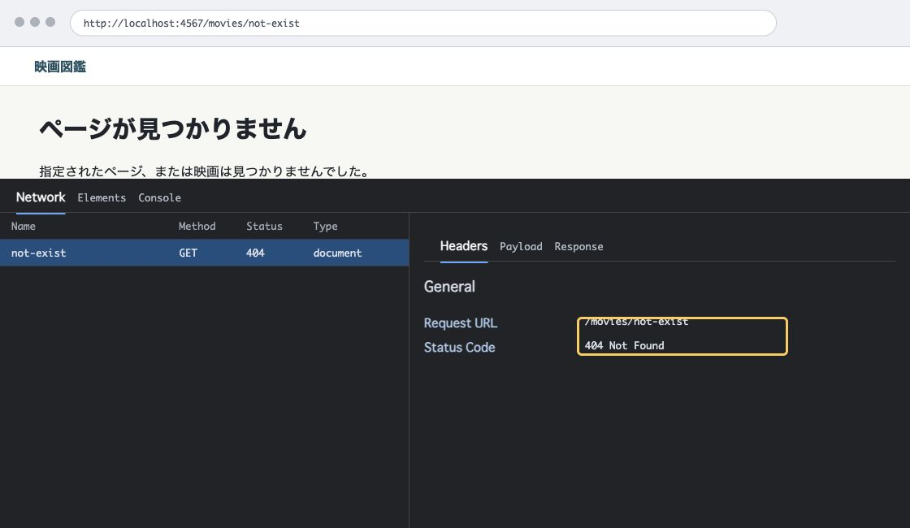

# 第10章 見つからないものには 404 を返す

第9章では、利用者入力をそのまま HTML にしないことを学びました。この章では、URL で指定されたものが見つからない場合を扱います。

存在しない URL と存在しない映画 ID に 404 を返す処理を作り、アプリのバグによる 500 との違いを確認します。最後に、ここまで作ってきた映画図鑑の完成状態も見直します。

## 404 は「見つからない」というレスポンス

404 は、リクエストされたリソースが見つからないことを表す HTTP ステータスコードです。

映画図鑑では、次のような場合に 404 を返します。

- 存在しない URL にアクセスした。
- 存在しない映画 ID の詳細画面にアクセスした。
- 存在しない映画 ID の編集画面にアクセスした。
- 存在しない映画 ID を更新・削除しようとした。

大事なのは、画面に「見つかりません」と表示することだけではありません。HTTP レスポンスのステータスコードが 404 になっていることです。

## 404 ページを作る

`views/not_found.erb` を作ります。

```erb
<h1>ページが見つかりません</h1>

<p>指定されたページ、または映画は見つかりませんでした。</p>

<p>
  <a class="button-link" href="/movies">映画一覧へ戻る</a>
</p>
```

この ERB には、`html` や `body` は書きません。`layout.erb` が共通の HTML 構造を持っているためです。個別の ERB には、その画面固有の中身だけを書きます。

## 存在しない URL を扱う

Sinatra では、どのルートにも一致しないリクエストを `not_found` で扱えます。

```ruby
not_found do
  erb :not_found
end
```

これで、例えば次の URL にアクセスしたときに 404 ページが表示されます。

```text
http://localhost:4567/unknown
```

Network タブで、このリクエストのステータスコードが `404 Not Found` になっていることを確認してください。

<figure class="book-figure">
  
  <figcaption>図 10-1 404ページの表示とHTTPステータス</figcaption>
</figure>

この 404 ページは、存在しない URL と存在しない映画 ID の両方で使います。本書では、404 の種類ごとにページを出し分けることはしません。まずは、見つからないものに 404 ステータスと戻る導線を返すことを重視します。

## 存在しない映画 ID を扱う

存在しない URL だけではなく、存在しない映画 ID も 404 として扱います。

詳細画面では、ID で映画を探しています。

```ruby
get "/movies/:id" do
  @movie = find_movie(params["id"])
  if @movie.nil?
    status 404
    return erb :not_found
  end

  erb :show
end
```

`@movie` が `nil` なら、その ID に一致する映画はありません。`status 404` でレスポンスのステータスコードを 404 にし、`erb :not_found` で 404 ページを返します。

`not_found` は、どのルートにも一致しなかったときに使われます。一方、`/movies/:id` のようにルートには一致したものの、その中で映画が見つからない場合は、アプリ側で `status 404` を指定して 404 ページを返します。

次のような URL にアクセスして確認してください。

```text
http://localhost:4567/movies/not-found
```

画面だけでなく、Network タブのステータスコードを見ます。

## 編集・更新・削除でも 404 を返す

存在しない映画 ID は、詳細画面だけで発生するわけではありません。

編集画面でも、映画が見つからなければ 404 を返します。

```ruby
get "/movies/:id/edit" do
  @movie = find_movie(params["id"])
  if @movie.nil?
    status 404
    return erb :not_found
  end

  @errors = []
  erb :edit
end
```

更新と削除でも同じです。

```ruby
patch "/movies/:id" do
  movies = load_movies
  movie = find_movie_from(movies, params["id"])
  if movie.nil?
    status 404
    return erb :not_found
  end

  # 省略
end
```

```ruby
delete "/movies/:id" do
  movies = load_movies
  movie = find_movie_from(movies, params["id"])
  if movie.nil?
    status 404
    return erb :not_found
  end

  # 省略
end
```

見つからない ID を通常の処理に混ぜると、別のエラーにつながります。見つからないものは、見つからないものとして 404 を返します。

この章では、各ルートに同じような 404 処理が何度か出てきます。今は、どの入口で映画が見つからない可能性があるかを読みやすくするため、重複を残しています。あとから整理するなら、共通メソッドへ切り出すこともできます。

## 404 と 500 の違い

404 は、リクエストされたリソースが見つからないことを表します。

一方、500 は、サーバー側で予期しないエラーが起きたことを表します。

例えば、`app.rb` の末尾に一時的に次のようなルートを追加すると、アクセス時に例外が発生します。

```ruby
get "/error-example" do
  raise "確認用のエラー"
end
```

このルートへアクセスすると、アプリの中で例外が起きます。これは「見つからない」ではなく、サーバー側のエラーです。Network タブでは `500 Internal Server Error` として確認できます。

この確認用ルートは、動作確認が終わったら必ず削除してください。映画図鑑の完成コードには残しません。

## 映画図鑑の完成状態を確認する

ここまでで、映画図鑑には次の機能が揃いました。

| 機能 | ルート |
| --- | --- |
| トップから一覧へ移動 | `GET /` |
| 一覧表示 | `GET /movies` |
| 新規登録画面 | `GET /movies/new` |
| 登録処理 | `POST /movies` |
| 詳細表示 | `GET /movies/:id` |
| 編集画面 | `GET /movies/:id/edit` |
| 更新処理 | `PATCH /movies/:id` |
| 削除処理 | `DELETE /movies/:id` |
| 存在しない URL | 404 |
| 存在しない映画 ID | 404 |

完成状態では、次のファイルがあります。

```text
.
├── app.rb
├── data/
│   └── movies.json
├── public/
│   └── stylesheets/
│       └── application.css
└── views/
    ├── edit.erb
    ├── index.erb
    ├── layout.erb
    ├── new.erb
    ├── not_found.erb
    └── show.erb
```

起動に必要な環境ファイルも確認します。

```text
.
├── .ruby-version
├── Gemfile
└── Gemfile.lock
```

確認する観点は次のとおりです。

- `bundle exec ruby app.rb` で起動できる。
- 映画データは `data/movies.json` に保存される。
- `data/movies.json` は `public/` に置かれていない。
- ID は `SecureRandom.uuid` で作られる。
- 登録、更新、削除の後はリダイレクトする。
- HTML フォームの PATCH、DELETE は `_method` を使う。
- タイトル必須チェックが登録と更新にある。
- 利用者入力は `h` ヘルパーで表示される。
- 紹介文の改行表示は CSS の `white-space: pre-line` で扱う。
- 存在しない URL と存在しない映画 ID は 404 になる。

この時点で、映画図鑑は小さな CRUD アプリケーションとして一通り動きます。第11章からは、動かないときにどこを見るかを学びます。

次章では、画面表示、Network タブ、Sinatra のログ、JSON ファイルを分けて見ながら、問題がどこで起きているかを切り分けます。

## この章の完成コード

第10章で追加した `views/not_found.erb` は次の形です。

```erb
<h1>ページが見つかりません</h1>

<p>指定されたページ、または映画は見つかりませんでした。</p>

<p>
  <a class="button-link" href="/movies">映画一覧へ戻る</a>
</p>
```

`app.rb` には、次の 404 関連の処理が入ります。

```ruby
get "/movies/:id" do
  @movie = find_movie(params["id"])
  if @movie.nil?
    status 404
    return erb :not_found
  end

  erb :show
end

not_found do
  erb :not_found
end
```

編集、更新、削除でも、映画が見つからない場合は同じように `status 404` と `erb :not_found` を返します。

## 確認しよう

1. `/unknown` にアクセスし、404 ページと `404 Not Found` を確認する。
2. `/movies/not-found` にアクセスし、404 ページと `404 Not Found` を確認する。
3. `/movies/not-found/edit` にアクセスし、404 ページと `404 Not Found` を確認する。
4. 存在しない映画 ID に対して更新や削除を送り、404 になることを確認する。
5. 一時的な `/error-example` ルートで 500 を確認し、確認後に必ず削除する。
6. 映画図鑑の完成状態のファイル、ルート、主要機能を照合する。

## 考えてみよう

- なぜ見つからない映画 ID を空の詳細画面として表示しないのでしょうか。
- 404 と 500 は、どちらもエラーに見えますが、何が違うのでしょうか。
- 画面にエラーメッセージが出ていても、Network タブでステータスコードを見る必要があるのはなぜでしょうか。

## さらに学ぶ

エラー処理をさらに学ぶときは、「要求したものがない状態」と「サーバー内部で処理に失敗した状態」を分けて追います。

- [MDN 404 Not Found](https://developer.mozilla.org/ja/docs/Web/HTTP/Status/404)では、サーバーへ到達していても対象のリソースが見つからない状態を学べます。
- [MDN 500 Internal Server Error](https://developer.mozilla.org/ja/docs/Web/HTTP/Status/500)では、サーバー側で予期しない失敗が起きたときの一般的な応答を学べます。
- [Sinatra 公式ドキュメント](https://sinatrarb.com/intro.html)では、`halt`、`not_found`、`error` を使い、状態ごとにレスポンスを分ける方法を確認できます。
