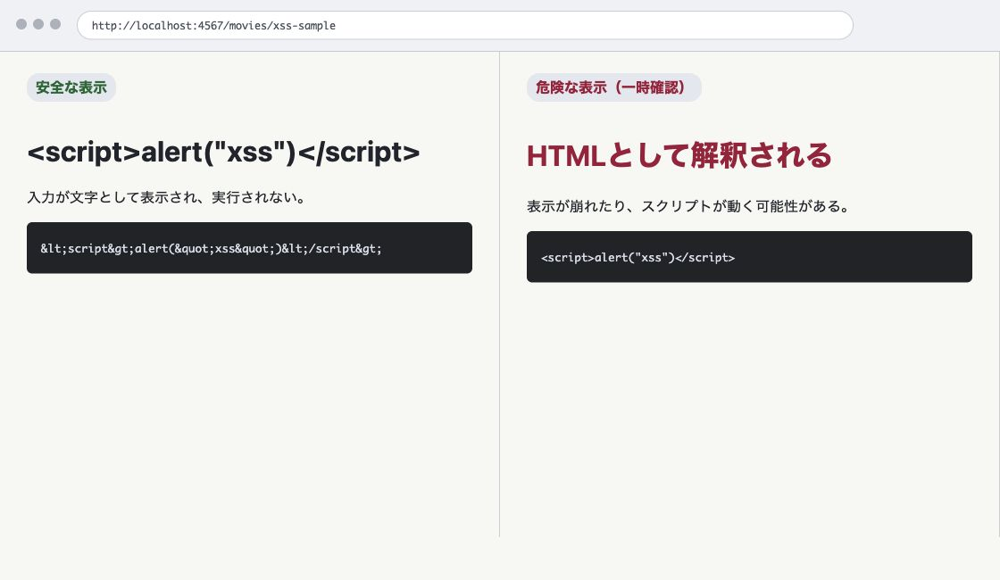

# 第9章 利用者の入力はそのまま HTML にしない

第8章では、登録・更新・削除の後にリダイレクトし、表示用の GET へ移る理由を学びました。

この章では、表示する値そのものに注目します。映画図鑑のタイトル、監督、公開年、ジャンル、紹介文は、すべて利用者が入力できる値です。その値をそのまま HTML にしたときに起きる問題を確かめ、`h` ヘルパーで安全に表示できる形へ変換します。

## 9.1 映画データはすべて利用者入力

映画図鑑では、次の値をフォームから登録・編集できます。

- タイトル
- 監督
- 公開年
- ジャンル
- 紹介文

これらは、アプリの作者があらかじめ用意した固定文字列ではありません。利用者が入力できる値です。

利用者入力を HTML として表示するときは、ブラウザに「HTML の一部」ではなく「文字」として解釈させる必要があります。そのために、第5章で `h` ヘルパーを導入しました。

ジャンルは画面上では選択肢から選びますが、サーバーにはリクエストの値として届きます。ブラウザの開発者ツールや別の HTTP クライアントから送られる可能性もあるため、表示するときはほかの入力値と同じようにエスケープします。

```ruby
helpers do
  def h(value)
    Rack::Utils.escape_html(value)
  end
end
```

`h` は、HTML で特別な意味を持つ文字を文字参照へ変換します。例えば `<` は `&lt;`、`"` は `&quot;` のように変換されます。

## 9.2 XSS とは

XSS は、Cross-site scripting の略です。利用者入力などをきっかけに、ブラウザへ意図しない HTML や JavaScript を解釈させてしまう問題です。JavaScript が実行される場合だけでなく、タグ構造や属性値が壊れることも問題になります。

この章では、攻撃手法を広く学ぶのではなく、Web アプリケーションを作るときの基本として、利用者入力をそのまま HTML にしないことを学びます。

安全なローカル環境で、危険な表示を一時的に作って確認します。確認後は、必ず安全なコードへ戻します。

確認用に登録した危険な文字列も、確認後に削除するか、退避しておいた `data/movies.json` へ戻してください。危険な確認用データを残したまま次の章へ進まないようにします。

## 9.3 安全な状態で入力してみる

まず、現在の安全なコードのまま、次のタイトルを持つ映画を登録してみます。

```html
<script>alert("xss")</script>
```

登録後の詳細画面では、アラートは実行されません。タイトルとして、文字がそのまま見えるはずです。

HTML レスポンスを見ると、実際には次のように文字参照へ変換されています。

```html
&lt;script&gt;alert(&quot;xss&quot;)&lt;/script&gt;
```

これは、`views/show.erb` でタイトルを `h` に通しているからです。

```erb
<h1><%= h(@movie["title"]) %></h1>
```

ブラウザは `&lt;` を「タグの始まり」ではなく、文字の `<` として表示します。

## 9.4 危険な表示を一時的に作る

ここからは、危険を理解するために一時的にコードを変更します。この変更は完成コードには残しません。確認が終わったら、必ず元に戻してください。

`views/show.erb` のタイトル表示を、次のように一時的に変更します。

```erb
<h1><%= @movie["title"] %></h1>
```

`h` を外すと、保存されたタイトルが HTML としてそのままレスポンスに入ります。

もう一度、タイトルに次の値を入れた映画の詳細画面を開きます。

```html
<script>alert("xss")</script>
```

ブラウザがスクリプトとして解釈すると、アラートが表示されます。これが、利用者入力をそのまま HTML にする危険です。

もしアラートが表示されない場合でも、レスポンス HTML に `<script>` がそのまま入っていれば、利用者入力が HTML として解釈される状態になっています。アラートが出ることそのものより、入力値が HTML の一部になってしまうことが問題です。

確認できたら、すぐに元へ戻します。

<figure class="book-figure">
  
  <figcaption>図 9-1 エスケープした表示とエスケープしない表示の違い</figcaption>
</figure>

```erb
<h1><%= h(@movie["title"]) %></h1>
```

## 9.5 属性値で壊れる入力

XSS は、`<script>` を本文に入れる場合だけの問題ではありません。HTML のどこへ出力するかによって、壊れ方が変わります。

編集フォームでは、タイトルを `value` 属性へ出力しています。

```erb
<input type="text" id="title" name="title" value="<%= h(@movie["title"]) %>">
```

ここに出力される値で試したい入力は、次のようなものです。

```html
"><script>alert("xss")</script>
```

`h` を使っていれば、`"` や `<` は文字参照になり、属性値を壊しません。

危険な例として、編集フォームで一時的に `h` を外すと、属性値を閉じてから別のタグを差し込めてしまいます。

```erb
<input type="text" id="title" name="title" value="<%= @movie["title"] %>">
```

この変更も、確認後は必ず元に戻します。

```erb
<input type="text" id="title" name="title" value="<%= h(@movie["title"]) %>">
```

## 9.6 `textarea` で壊れる入力

紹介文は `textarea` に表示されます。

```erb
<textarea id="description" name="description" rows="5"><%= h(@movie["description"]) %></textarea>
```

ここでは、次のような入力を確認します。

```html
</textarea><script>alert("xss")</script>
```

`h` を使っていれば、`</textarea>` は終了タグとして解釈されず、文字として表示されます。

危険な例として一時的に `h` を外すと、`textarea` を閉じたうえで別のタグを差し込めてしまいます。

```erb
<textarea id="description" name="description" rows="5"><%= @movie["description"] %></textarea>
```

確認後は、必ず元へ戻します。

```erb
<textarea id="description" name="description" rows="5"><%= h(@movie["description"]) %></textarea>
```

## 9.7 `<script>` だけ防げばよいわけではない

ここまで見たように、危険なのは `<script>` という文字列だけではありません。

同じ利用者入力でも、出力先によって必要な注意が変わります。

- HTML の本文に出す
- HTML 属性値に出す
- `textarea` の中に出す

本書では、これらをすべて `Rack::Utils.escape_html` を呼び出す `h` ヘルパーで扱います。これは、HTML の中へ文字として表示するための基本的なエスケープです。

ただし、`h` があらゆる場所で万能という意味ではありません。JavaScript の文字列や URL など、別の文脈へ値を埋め込む場合は、その文脈に合った扱いが必要です。本書では、HTML の本文、属性値、`textarea` に文字として表示する範囲を扱います。

## 9.8 映画図鑑で `h` を使う場所

映画図鑑では、利用者入力を表示する場所で `h` を使います。

一覧画面では、タイトル、公開年、ジャンルを表示しています。

```erb
<td><%= h(movie["title"]) %></td>
<td><%= h(movie["year"]) %></td>
<td><%= h(movie["genre"]) %></td>
```

詳細画面では、すべての属性を表示しています。

```erb
<h1><%= h(@movie["title"]) %></h1>
<dd><%= h(@movie["director"]) %></dd>
<dd><%= h(@movie["year"]) %></dd>
<dd><%= h(@movie["genre"]) %></dd>
<dd class="movie-description"><%= h(@movie["description"]) %></dd>
```

登録フォームや編集フォームで入力済みの値を戻すときも、`h` を使います。

```erb
<input type="text" id="title" name="title" value="<%= h(@movie["title"]) %>">
<textarea id="description" name="description" rows="5"><%= h(@movie["description"]) %></textarea>
```

ERB の `<%= %>` は、値を出力するための書き方です。自動で安全な HTML にしてくれる、と考えてはいけません。本書では、利用者入力を表示するときに明示的に `h` を使います。

## 9.9 改行表示は CSS で扱う

紹介文の改行表示は、第6章で追加した CSS で扱っています。

```css
.movie-description {
  white-space: pre-line;
}
```

Ruby 側で次のように HTML を作る方法は使いません。

```ruby
description.gsub("\n", "<br>")
```

利用者入力をもとに HTML を組み立てると、エスケープとの関係が複雑になります。文字は `h` で安全に表示し、見た目の改行は CSS で扱います。

## 9.10 この章の完成コード

この章では、完成コードに残す変更はありません。第8章までの安全なコードを維持します。

最終的に、危険な確認用コードが残っていないことを確認してください。

```erb
<h1><%= h(@movie["title"]) %></h1>
```

```erb
<input type="text" id="title" name="title" value="<%= h(@movie["title"]) %>">
```

```erb
<textarea id="description" name="description" rows="5"><%= h(@movie["description"]) %></textarea>
```

危険を確認するために `h` を外した場合は、必ず戻してから次へ進みます。

次章では、利用者入力だけでなく、URL で指定された映画 ID も信用しすぎないことを扱います。存在しない ID や存在しない URL に対して、アプリがどう応答するかを見ていきます。

## 確認しよう

1. タイトルに `<script>alert("xss")</script>` を入れて映画を登録し、安全なコードではアラートが実行されないことを確認する。
2. レスポンス HTML で `<` や `"` が文字参照になっていることを確認する。
3. ローカル環境で一時的に `h` を外し、危険な表示を確認する。
4. 確認後、必ず `h` を戻す。
5. `"><script>alert("xss")</script>` をタイトルに入れ、編集フォームで属性値が壊れないことを確認する。
6. `</textarea><script>alert("xss")</script>` を紹介文に入れ、編集フォームで `textarea` が壊れないことを確認する。

## 考えてみよう

- なぜ `<script>` という文字列だけを禁止しても十分ではないのでしょうか。
- なぜ ERB の `<%= %>` だけで安全だと考えてはいけないのでしょうか。
- なぜ紹介文の改行表示を Ruby の `gsub` ではなく CSS で扱うのでしょうか。

## さらに学ぶ

入力値を安全に表示する理由を深めるには、攻撃の成立条件と、出力する場所に合ったエスケープを学びます。

- [OWASP XSS](https://owasp.org/www-community/attacks/xss/)では、クロスサイトスクリプティングが成立する仕組み、代表的な種類、基本的な防御を学べます。
- [MDN Cross-site scripting](https://developer.mozilla.org/ja/docs/Glossary/Cross-site_scripting)では、ブラウザ上で不正なスクリプトが実行される危険を、Web の基礎用語と結び付けて確認できます。
- [Rack Utils](https://rack.github.io/rack/main/Rack/Utils.html)では、本章の `h` ヘルパーが利用する HTML エスケープ処理を確認できます。
- [Ruby ERB](https://docs.ruby-lang.org/ja/latest/library/erb.html)では、Ruby の値をテンプレートへ埋め込む記法と、ERB 自体が担当する範囲を学べます。
